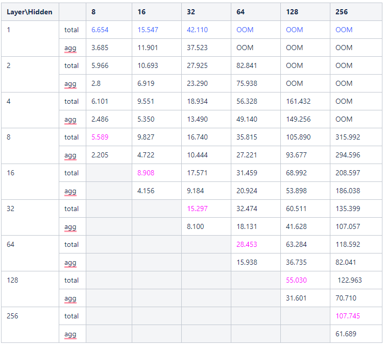

# GNN-Feature-Decomposition

### ***NOTE!***
After our cooperation with the [PyG team](https://github.com/pyg-team/pytorch_geometric), the feature decomposition method has been improved and added
to the [PyG framework](https://github.com/pyg-team/pytorch_geometric) as an optional feature. For more details and how to use please refer to 
[Feature Decomposition in PyG](#Feature-Decomposition-in-PyG)

  

--------------------------------------------------------------------------------

### Overview

This is a repository for our work: GNN Feature Decomposition,
which is accepted by RTAS 2021(Brif Industry Track), named ***"Optimizing Memory Efficiency of Graph NeuralNetworks on Edge Computing Platforms"***

For more details, please see our full paper: https://arxiv.org/abs/2104.03058 

Graph neural networks (GNN) have achieved state-of-the-art performance on various industrial tasks.
However, the poor efficiency of GNN inference and frequent Out-Of-Memory (OOM) problem limit the successful application of GNN on edge computing platforms.
To tackle these problems, a feature decomposition approach is proposed for memory efficiency optimization of GNN inference.
The proposed approach could achieve outstanding optimization on various GNN models, covering a wide range of datasets, which speeds up the inference by up to 3x.
Furthermore, the proposed feature decomposition could significantly reduce the peak memory usage (up to 5x in memory efficiency improvement) and mitigate OOM problems during GNN inference.

### Requirements

Recent versions of PyTorch, numpy, torch_geometric(1.6.3) are required. 

### Contents
There are two main top-level scripts in this repo:

    1.test_gnn_layer.py: runs a gnn feature decomposition method on single GNN layer.
    2.test_gnn_total.py: runs a gnn feature decomposition method on total gnn models.
    
### Running the code
#### test single gnn layer by our feature decomposition method.
    cd test
    python test_gnn_layer.py --hidden=32 --agg="gas" --m="GCN" --layer=32 --data="rd"
    
#### test total gnn model by our feature decomposition method.
    cd test
    python test_gnn_total.py --hidden=32 --agg="gas" --m="GCN" --layer="32,41" --data="rd"

- hidden: the hidden layer size of gnn.
- agg: the aggregate model, include spmm and gas. if using feature decomposition, there shoule be "gas".
- m: the gnn model name,include "GCN,GAT,GIN,SAGE".
- layer: the layers of feature decomposition along dimension of feature vector, the basic gnn inference using 1 layer.
if test total gnn model,there should be two parameters.
- data: dataset name.

### Feature Decomposition in PyG

---

We integrated the feature decomposition into the [`MessagePassing`](https://github.com/pyg-team/pytorch_geometric/blob/master/torch_geometric/nn/conv/message_passing.py) 
module of the [PyG framework](https://github.com/pyg-team/pytorch_geometric). Specifically, we added an optional argument `decomposed_layers: int = 1` to the initialization 
function of the [`MessagePassing`](https://github.com/pyg-team/pytorch_geometric/blob/master/torch_geometric/nn/conv/message_passing.py) module, as shown below.

    def __init__(self, aggr: Optional[str] = "add",
                 flow: str = "source_to_target", node_dim: int = -2,
                 decomposed_layers: int = 1):

When creating a layer, pass in the `decomposed_layers` (>1) to use the feature decomposition method. As fllows:

    conv = GCNConv(16, 32, decomoposed_layers = 2 )

For specific usage, please refer to the [example](example/GCN.py)

---
The following table is the test result of the [GCNConv](https://pytorch-geometric.readthedocs.io/en/latest/modules/nn.html#torch_geometric.nn.conv.GCNConv) layer on the reddit data set.
It can be seen that the best acceleration effect can be achieved when the decomposition granularity is the largest (Not mean that all layers are like this).
The only rule that we can be sure of is:
     
For a given graph, there is an optimal dimension of one decomposed layer, which does not change with the hidden layer dimension 
(eg: as the following table, it is optimal to set the dimension of the decomposed layer to 1, which means decomoposed_layers = hidden layer ).

  

- The horizontal axis : represents the hidden layer dimension of [GCNConv](https://pytorch-geometric.readthedocs.io/en/latest/modules/nn.html#torch_geometric.nn.conv.GCNConv). 
- the vertical axis : equal to the `decomposed_layers`, which means the granularity of feature decomposition. 
- total : means the running time of whole layer.
- agg : means the running time of Aggregation phase of GCNConv. 

